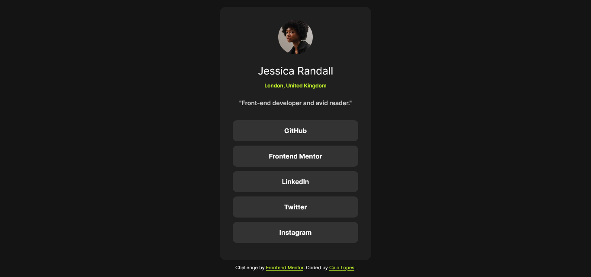
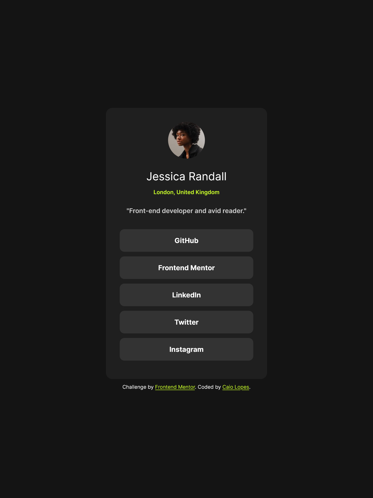
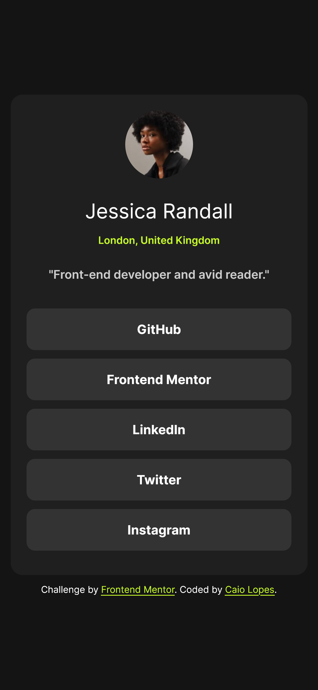

# Frontend Mentor - Social links profile solution

Esta é minha solução para o desafio [Social links profile](https://www.frontendmentor.io/challenges/social-links-profile-UG32l9m6dQ) no Front-End Mentor.

## Conteúdo

- [Overview](#overview)
  - [Screenshot](#screenshot)
  - [Links](#links)
- [Sobre o projeto](#sobre-o-projeto)
  - [Feito com](#feito-com)
  - [O que aprendi](#o-que-aprendi)
  - [Desenvolvimento contínuo](#desenvolvimento-contínuo)
  - [Recursos Extras](#recursos-extras)
- [Autor](#autor)
- [Agradecimentos](#agradecimentos)

## Overview

### Screenshot

- **Desktop | width >= 1366px**



- **Tablets | width: 810px**



- **Smartphones | width: 375px**



### Links

- Projeto URL: [Repositório GitHub](https://github.com/CaioLopes5556/)
- Live Site: [Deploy do Projeto](https://caiolopes5556.github.io/)

## Sobre o projeto

### Feito com

- Semantic HTML5 markup
- CSS custom properties
- Flexbox

### O que aprendi

Para além do desafio proposto, consegui praticar mais alguns conhecimentos de boas práticas no desenvolvimento do código, como:

- Utilização de variaveis CSS para auxiliar na manutenção das cores utilizadas neste projeto;

- Utilização da unidade de medida REM, que ajuda na legibilidade e acessibilidade do projeto;

- Organização dos arquivos;

- Uso de pseudo-classes para efeitos no projeto;

E também adquiri conhecimento de uma forma alternativa de importar fonte, utilizando um arquivo dentro do projeto:

```CSS
@font-face {
    font-family: 'Inter';
    src: url(../assets/fonts/Inter-VariableFont_slnt\,wght.ttf);

}
```

### Desenvolvimento Contínuo

Continuarei estudando sobre métodos para deixar páginas webs responsivas a diferentes tamanhos de tela.
Ainda tenho algumas dúvidas em relação ao HTML semântico, então farei o posssível para aprender melhor
estes conceitos e saber qual tag utilizar em cada situação.

Também estudarei mais sobre a metodologia BEM, para uma boa organização e padronização do código.

### Recursos Extras

- [MDN Web Docs](https://developer.mozilla.org/en-US/docs/Web/CSS) -
  Este site me ajudou a tirar dúvidas em relação a algumas propriedades do CSS.

## Autor

- Frontend Mentor - [@CaioLopes5556](https://www.frontendmentor.io/profile/CaioLopes5556)
- Linkedin - [@caio-silva-42848a236](https://www.linkedin.com/in/caio-silva-42848a236)

## Agradecimentos

Gostaria de agradecer a comunidade do Front-End mentor pelo FeedBack nos últimos projeto.
